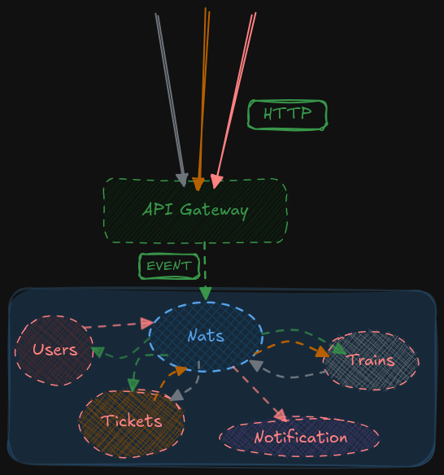

# Ticket

Welcome to **Ticket** – an Event-driven Microservice written in Go where each service is implemented based on Hexagonal architecture principles. This practice project is designed for simplicity and as an exercise with event driven architecture(not just a simple pub/sub), making it approachable for anyone wanting to learn,explore and contribute.

---

## 🚄 What is Ticket?

Ticket is a train ticket booking system built with an **event-driven architecture**. It allows users to register, book and cancel tickets, manage trains and thier seats, and receive notifications on specfic operations and so on.

---

## 🛠 Technologies Used

- **Go** (Golang): The entire backend is written in Go.
- **RESTful API**:API Gateway accepts HTTP requests and interact to services via event(nats request/reply) also exposes clear rest API for operations(implemented with Fiber).
- **Nats/JetStream**: Utilized as event bus exposing robust features and also written in Go
- **Postgresql**: As database(Where each service has own database)
- **Protocol Buffers**: Used as event payload serialization format because of it's elegant performance.

---

## 📝 TODO List

 - [ ] **Add authentication & authorization** (secure endpoints)
 - [ ] **Improve error handling**
 - [x] **Complete API Gateway**
 - [ ] **Implement Travel,Commnets and City services** 
 - [ ] **Comprehensive testing** (unit & integration)
 - [ ] **Notifications for booking tickets** 
 - [ ] **Front-end client** (React/Vue/Angular)
 - [ ] **Documentation** – expand with API specs and code walkthroughs

---

## 📦 Getting Started
### Prerequisites
- Go
- PostgreSQL
- Nats(JetStream enabled)

1. **Clone the repository**  
   `git clone https://github.com/AssassinRobot/Ticket.git`

2. **Run**  
   - See .env for configuration format and config based on provided format
   - `go run main.go` in each module
---

## 🙌 Contributing

Beginner or expert, all contributions are welcome! Open an issue or submit a pull request.
